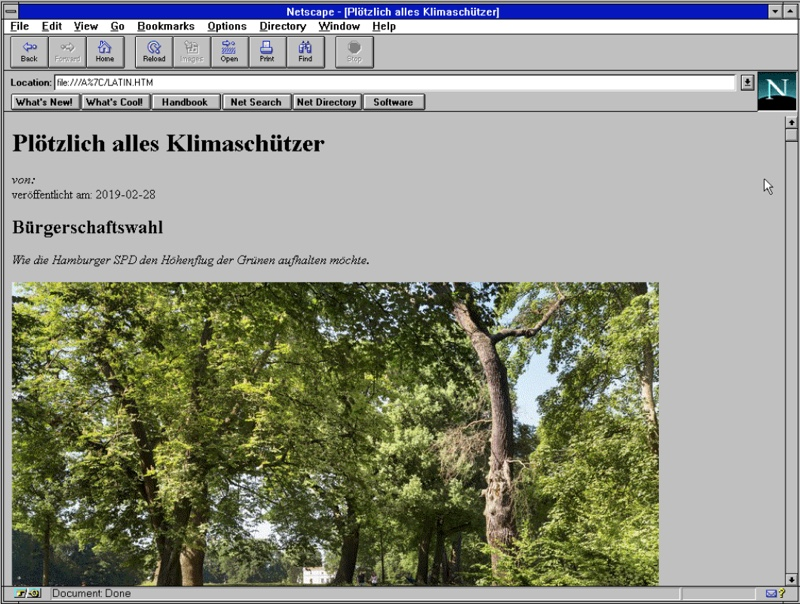

# zeit-offline

Ein XSLT-basierter Konverter für die Volltext-Umwandlung von
zeit.de-Artikeln von XML in HTML.

## Einführung

Wie auf [zeit.de](https://www.zeit.de/hilfe/rss-hilfe) beschrieben, gibt
es für jeden ZEIT-Artikel eine Volltext(!)-XML-Version, die durch
Veränderung der URL erreicht werden kann. Diese XML-Version ist zwar
nicht menschen- aber maschinenlesbar und kann durch Umwandlung wieder in
eine menschen- bzw. browserlesbares Format gebracht werden. Dieses
Projekt bietet die technischen Hilfsmittel zur Umwandlung.

## Technischer Hintergrund

ZEIT Online bietet offiziell einen Großteil seines Text-Angebots im
Volltext über das XML-Interface unter xml.zeit.de. Die XML-Version einer
Seite kann erreicht werden, in dem in der URL das "https://www" durch
"http://xml" ersetzt wird (Beispiel siehe unten). Der klassische Weg, um
XML in ein anderes Format umzuwandeln ist eine [XSL
Transformation](https://de.wikipedia.org/wiki/XSL_Transformation), kurz XSLT.
Kernstück dieses Projekt ist das XSLT "zeitoffline.xslt", mit dem
Artikel von XML in HTML umgewandelt und dann im Browser gelesen
werden können. Die Umwandlung ist absichtlich einfach gehalten und
bietet die Möglichkeit, weiter verfeinert zu werden.

## Warum?

Das Stylesheet war ein Urlaubsprojekt, weil… es geht. Auslöser war das
Experiment, mit einem Windows 3.11 Rechner zeit.de darzustellen. Der
Jahrzehnte alte Browser war nicht mehr in der Lage, mit dem modernen SSL
und CSS/Javascript auf der Seite umzugehen. Mit Hilfe von zeitoffline
konnten die Artikel so umgewandelt werden, dass das Anzeigen eines
Artikels wieder möglich ist, wie dieser Screenshot zeigt:



Die umgewandelte Version sieht derzeit zwar nicht gut aus, bietet aber
viele Vorteile: Sie lädt schnell - auch in alten Browsern, ist komplett
tracking- und ablenkungsfrei und kann die Grundlage für eine nach
eigenen Wünschen zugeschnittene barrierefreie Version sein.

## Beispiel mit xsltproc

xsltproc ist ein weit verbreiteter XSLT-Prozessor, der XSLT auf XML
anwenden kann. Nehmen wir den Beispiel-Artikel:

https://www.zeit.de/2009/29/Pooh

und wandeln die URL um in:

http://xml.zeit.de/2009/29/Pooh

Die XML-Variante muss nun runtergeladen und dann mit xlstproc
umgewandelt werden. Die Ergebnis-Datei artikel.html kann direkt im
Browser betrachtet werden:

```
$ wget http://xml.zeit.de/2009/29/Pooh -O artikel.xml
$ xsltproc zeitoffline.xslt artikel.xml > artikel.html
```

## Nutzung von render.sh

Einfacher geht es mit dem Beispiel-Script render.sh, das die Schritte
automatisch durchführt, wenn die notwendigen Programme vorhanden sind:

```
$ ./render.sh https://www.zeit.de/2009/29/Pooh
```

## Mindestvoraussetzungen

Theoretisch kann eine Vielzahl von Software zum Einsatz kommen. Getestet
wurde die Umwandlung jedoch mit
[xsltproc](http://xmlsoft.org/XSLT/xsltproc.html). Das Script
"render.sh" benötigt zudem curl oder wget und wurde unter Linux und
MacOS getestet.

## TODO

* Da die Artikel auf zeit.de nicht völlig homogen formatiert sind, gibt
  es immer wieder Artikel, deren Struktur aktuell nicht perfekt vom
  Stylesheet behandelt werden.
* Das Design könnte durchaus mit CSS etwas attraktiver gemacht werden
  und sich besser an verschiedene Bildschirmgrößen anpassen.
* Für das Lesen eines Artikels unter Windows 3.11 war es zusätzlich
  nötig, von UTF8 nach Latin umzuwandeln. Dies könnte per Option ins
  render.sh integriert werden. Beispiel: `iconv -f UTF-8 -t ISO-8859-1
  -c artikel.html > latin.htm`
* Die Integration in ein Browser-Plugin wäre praktisch, muss ggfs. aber
  rechtlich geprüft werden.

## Warum "zeitoffline"

Der Name verweist darauf, dass die Umwandlung der Artikel nicht
automatisiert online erfolgt, sondern ausschließlich auf dem eigenen
Rechner. Die Artikelfotos werden übrigens nicht gespeichert, sondern
beim Betrachten eines Artikels von einer Original-Quelle nachgeladen.

## Lizenz

Das Projekt steht unter GNU GPL, siehe LICENSE.
